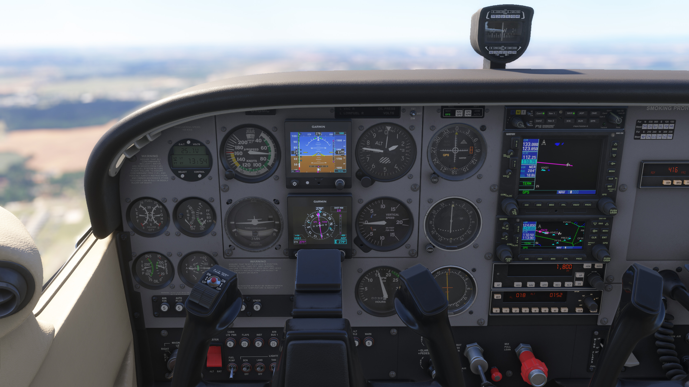
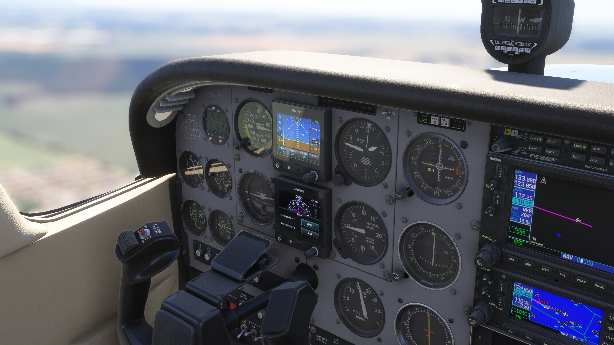
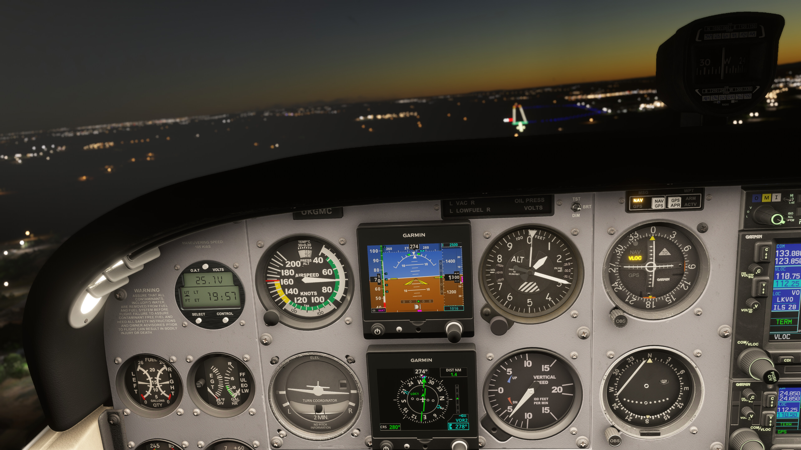
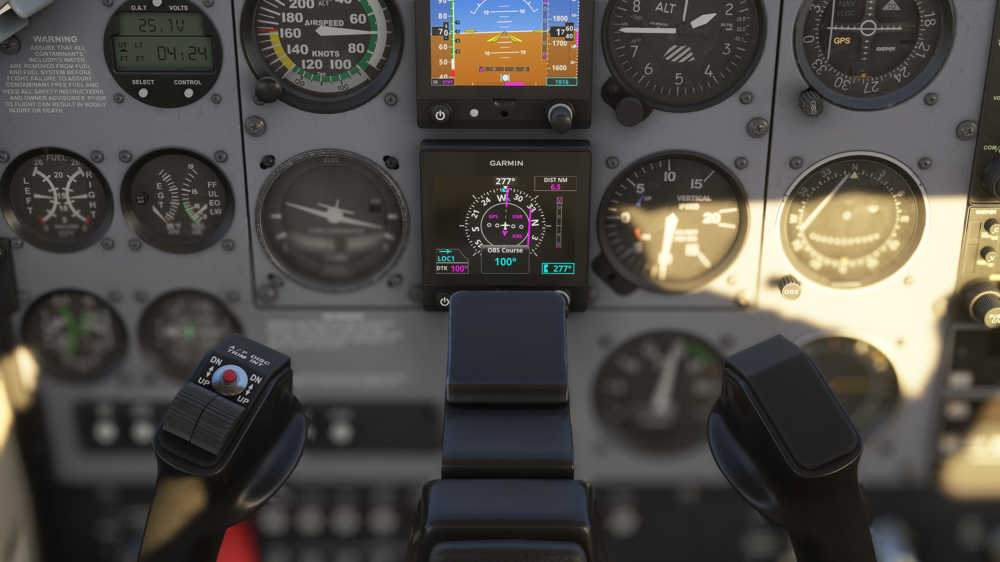
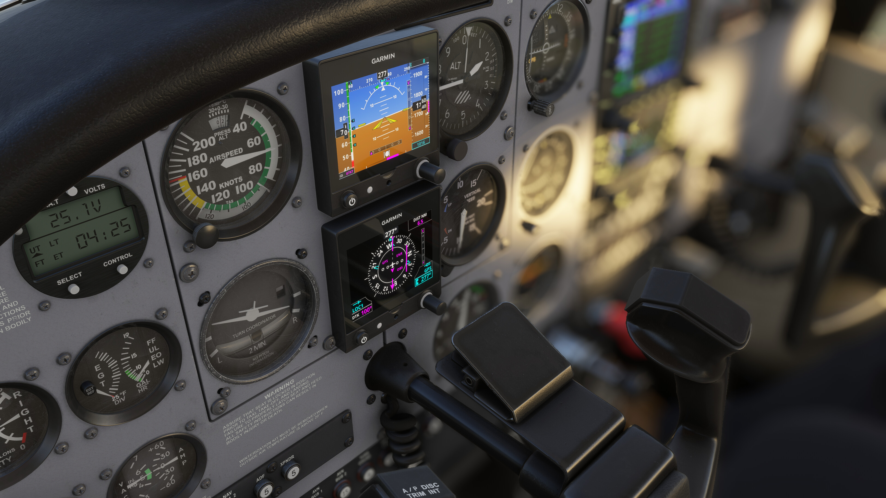
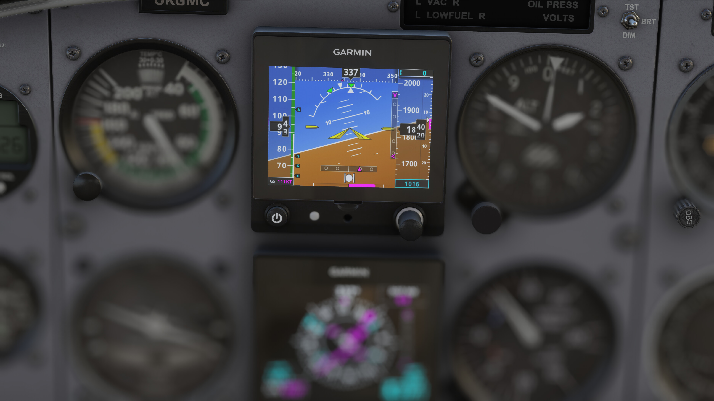
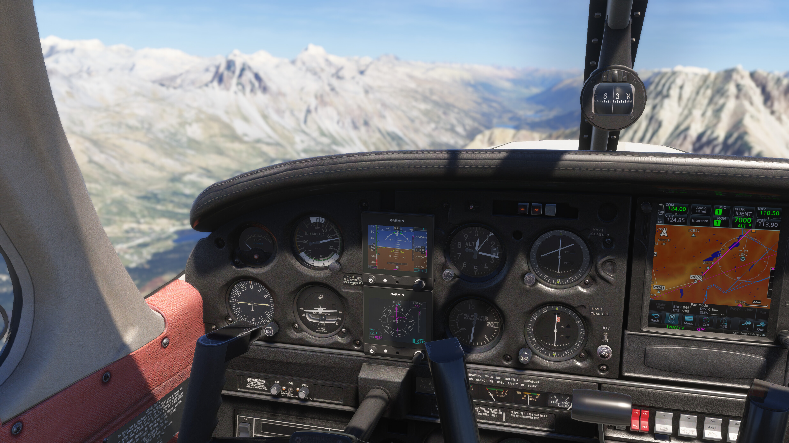

# Garmin G5 Improvements for MSFS 2024

## Introduction

This addon is based on the original addon by tb110188 and Sal1800: [Enhanced Garmin G5 Attachment](https://flightsim.to/addon/104825/enhanced-garmin-g5-attachment).

I started this project while training for my instrument rating to familiarize myself with the avionics used in the plane I fly in real life.
As the original plugin by `tb110188` and `Sal1800` lacked many IFR-essential features and differed visually in some ways, I first modified the original
source files, but eventually decided to completely rewrite it for the MSFS 2024 SDK using its avionics code patterns.

The initial refactor was done with the help of LLMs, so the quality may be flaky in some places and bug reports are welcome!
The project was switched to TypeScript and modern tooling, keeping the Rollup bundler as suggested by the MSFS SDK.

<div align="center" width="100%">
  
  
  
  
  
  
  
</div>

## Disclaimer

This is an unofficial, non-commercial flight simulator addon, and is not affiliated with, endorsed by, or
sponsored by any of the following.

**Garmin.** "Garmin" and "G5" are trademarks of Garmin Ltd. or its subsidiaries. This addon is a simulation of
the appearance and behaviour of a G5 electronic flight instrument for entertainment purposes only. It is not a
Garmin product, it is not certified for any real-world use, and it must never be used for actual navigation or
flight planning.

**Asobo Studio / Microsoft.** Microsoft Flight Simulator and its aircraft are the property of Microsoft and
Asobo Studio.

**Just Flight.** The PA28 Warrior II aircraft is a separate commercial product by Just Flight and is not
included here. The variant shipped by this addon only references an installation you already own.

## Installation

As a community addon, place the addon folder into your MSFS Community folder, or use a tool like [MSFS Addons Linker](https://flightsim.to/addon/1572/msfs-addons-linker)
to manage your addons.

## Current Status

Currently, I have only added the G5 avionics into the default Cessna 172 from Asobo, similar to what the original plugin by `tb110188` does.
You can request support for additional aircraft via GitHub issues.

### PFD

I tried to make the PFD features and visuals as close to the real G5 (the one I use in real life) as possible, even though there are some compromises,
e.g., due to the different aspect ratio. As I fly in Europe, the baro uses hPa units (not inHg), but supporting both is on the roadmap.

A few things that were added/redesigned:

- Reference speed badges (Vy, Vx, Vg, Vr)
- Speed tape design
- Turn & Slip indicator including Rate-1 turn indications on attitude indicator
- Ball, CDI and VDI visual
- Vertical speed indicator
- QNH in hPa

### TODO

- [x] Support inHg units for baro.
    - Baro units can be changed in Menu -> Setup of the PFD
- [ ] Display Nav Course and maybe other ticks on Horizontal Compass.
- [ ] Add full AFCS status box - currently the AP is not really supported, but will come soon in GPSS mode.

### MFD

The MFD tries to mimic the MFD I use in real life as well; however there are more configuration options and navigation modes, which depend on avionics integration.
For example, as the C172 model from Asobo lacks a standalone DME, I decided to keep the HSI waypoint distance visible for VLOC mode as well, even though normally it should not be displayed.

A few things that were added/redesigned:

- Bearing pointers and their setup in the menu
- Menu, submenus and dropdowns, e.g. to select bearing pointer source
- OBS course selector
- Heading vs track indication
- VDI
- DTK/CRS modes in lower left panel
- NAV mode and phase indications

### TODO

- [x] Improve the VNAV indication, especially in LNAV/VNAV mode and ENR VNAV.
- [ ] Improve GPS source and scale annunciations, as MSFS differs from reality in some cases.
- [x] Add GPSS toggle - done basic GPSS. Enabled via using HDG mode mode in AP

## Development

### Development Setup

The only thing needed to build the project is [Node.js and npm](https://nodejs.org/en). Follow the official website for installation, or use a version management tool such as
[NVM](https://www.nvmnode.com).

The recommended versions:
- Node.js v24+
- npm v11+

### Testing in MSFS 2024

You can open the project stored in [garmin-g5-enhanced](./garmin-g5-enhanced/) in MSFS 2024 Dev Mode. While developing, run `npm run build` and then refresh the avionics in MSFS 2024 to see the changes.

### Source code layout

The instrument sources live in `src/instruments/Enhanced-AS5/`, with the code organized under `modules/` as follows:

```text
modules/
├── AS5.tsx                  instrument entry point
│
├── common/                  cross-cutting code shared by PFD & MFD
├── pfd/                     PFD display components & layout
├── mfd/                     MFD display components & layout
├── publishers/              EventBus SimVar publishers
└── providers/               data providers, nav infrastructure & types
```

Common commands:

- `npm run format` — format the code (run after every change)
- `npm run lint` — lint the code and fix warnings
- `npm run build` — build the addon

### Code Style & Patterns

For maintaining the existing code style, please use the configured linter and formatter (oxc) and their rules.
In general, it's encouraged to follow React best practices for writing components, where applicable.

When developing components (parts of the UI), please familiarize yourself with the [Reactive.ts](src/instruments/Enhanced-AS5/modules/common/Reactive.ts) module, which should serve as a base class for all components. Thanks to helpers like `track` and `consume`, the lifecycle of reactive elements like Subjects is handled automatically,
and resources are not leaked or left behind.
